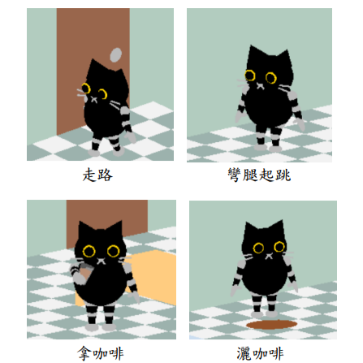
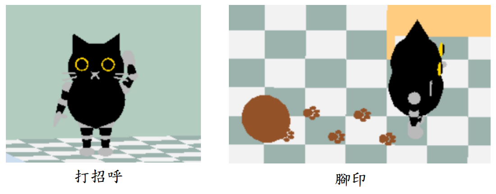
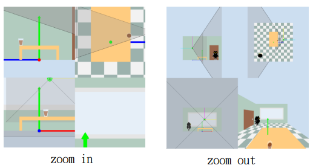
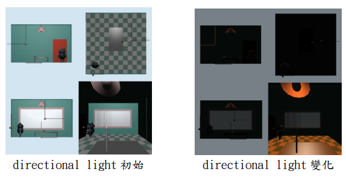
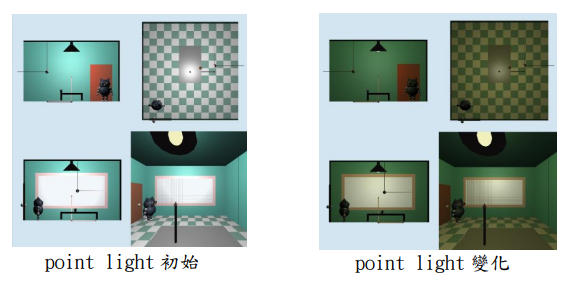
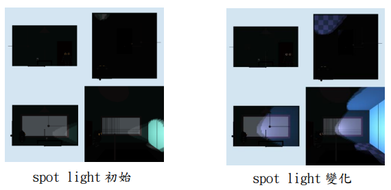
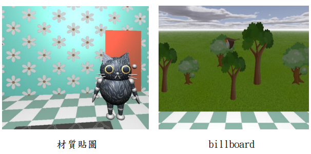
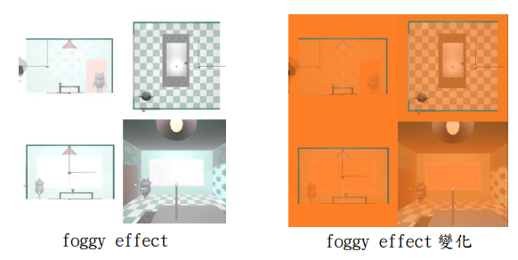

# Computer_Graphics_Robot
#### 詳細介紹可見 [作業報告](作業報告)
## 機器人的動作

### 對應按鍵
* 轉圈 - 按下 a、d 控制轉圈角度。
* 走路 - 按下 w 會往機器人面對的方向前進。
* 原地跳 - 按下 j 會彎腿向上跳。
* 拿/放東西(咖啡) - 當足夠靠近時，按下 s 可拿起咖啡，且在拿著咖啡時再按下 s 會將咖啡灑在機器人前方地面。
* 打招呼 - 按下 h 會做出揮手動作。
  
## 視角功能

### 對應按鍵
* 0 : 四種投影同時呈現
* 1 : x 軸方向的正交投影
* 2 : y 軸方向的正交投影
* 3 : z 軸方向的正交投影
* 4 : 攝影機方向的透視投影
* [ : zoom in 
* ] : zoom out
* \: view volume
* T、t : 攝影機的 pitching
* Y、y : 攝影機的 heading
* U、u : 攝影機的 rolling
* I、i : 攝影機 x 軸方向的移動
* O、o : 攝影機 y 軸方向的移動
* P、p : 攝影機 z 軸方向的移動

## 燈光功能

### 對應按鍵
* directional light - 陽光
  * 5 : 控制開關
  * 空格鍵 : 會有時間變化，陽光的方向會跟著改變
  * z : 可改變顏色
  * x、X : 控制光的強度 
* point light - 室內燈
  * 6 : 控制開關
  * c : 可改變顏色
  * v、V : 控制光的強度
* spot light - 機器人的眼睛光
  * 7 : 控制開關
  * b : 可改變顏色
  * n、N : 控制光的強度
  * q、Q : 控制機器人抬頭和低頭
  * e、E : 控制光的 cutoff

## 材質貼圖及場景製作

### 功能介紹
* texture  
    在貓咪機器人的身上貼上毛的紋路、地上貼上地毯的圖案，以及牆壁貼上花朵壁紙，且壁紙會根據時間用texture matrices來變化，r 能切換壁紙呈現直線移動或是旋轉移動。
* billboard  
    當視角轉到戶外時，能看到樹和鳥的billboard，且兩種樹和鳥都是利用key frames來製作出動態效果，其中鳥會根據時間在場景中移動。
* foggy effect  
    按下m增加density、M 減少density，按下,能更換顏色 ，按下.則能變換fog的模式。
* 天空盒  
    在場景中增加天空盒的效果。

